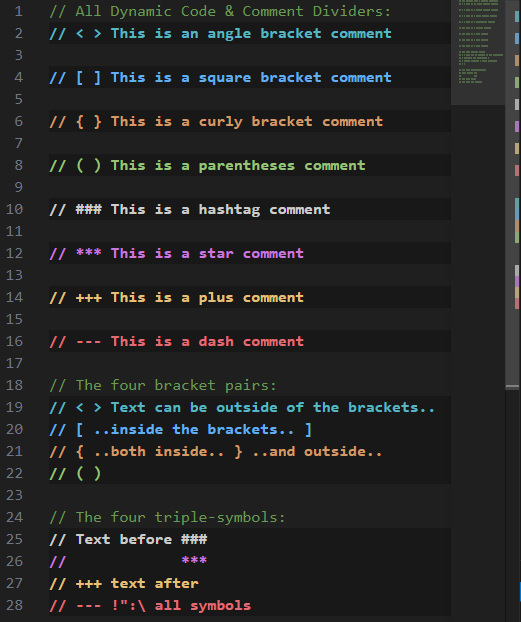

# Dynamic Code & Comment Divider

Enhance code readability with dynamic, theme-aware dividers for code and comments.  
Organize your workspace visually with customizable line highlights and section breaks.

---

## ✨ Features

- Highlight entire lines with distinct, theme-consistent background and foreground colors.
- Apply visual markers to different types of lines (e.g., comments, section headers, annotations).
- Easily differentiate code regions using colorful, semantic dividers.
- Find your comments or categories fast using scrollbar markers.
- Lightweight and fast – uses native VS Code decoration APIs.

> 

---

## ⚙️ Extension Settings

You can now customize divider colors, font styles, and weights for each divider type directly from the VS Code settings UI. Look for settings under `Dynamic Code & Comment Divider` or `dccd` in your VS Code settings.

Available settings include:

- Color, font style, and font weight for each divider type: curly, square, paren, star, dash, plus, angle, bar
- All settings are theme-aware and update instantly

---

## 🚀 Activation

The extension currently activates after VS Code startup and window reload.

---

## 📦 Requirements

No external dependencies are required. Works out of the box with any VS Code theme.

---

## 🐞 Known Issues

- Decorations may conflict visually with certain high-contrast themes.
- All lines matching regex patterns will be styled identically until per-type configs are introduced.

If you encounter unexpected behavior, feel free to open an issue on the repository.

---

## 📜 Release Notes

#### 1.4.5

- Added the GitHub Sponsor button.

#### 1.4.4

- Exposed configuration settings for divider colors, styles, and weights in the VS Code settings UI.
- Added more divider syntax options for greater flexibility and customization.

#### 1.4.3

- Updated changelog and added license file GNU General Public License v3.0

#### 1.4.2

- Readme and metadata updated for Marketplace
- Cross-extension performance improved

#### 1.4.1

- Internal refactor
- Readme and metadata updated for Marketplace

#### 1.4.0

- Added additional color types for dividers
- Improved performance and styling fidelity

#### 1.0.0

- Initial release with base divider types and decorations

---

## 🧩 Extension Info

- Name: dccd
- Display Name: Dynamic Code & Comment Divider
- Keywords: decorator, divider, highlight, comment, visual, code style

---

### Enjoy cleaner, more structured code with Dynamic Code & Comment Divider!
